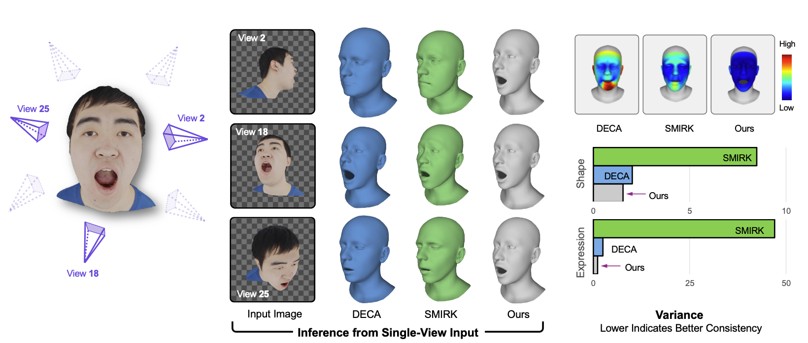

# KaoLRM

**Repurposing Pre-trained Large Reconstruction Models for Parametric 3D Face Reconstruction** (3DV 2026)

<a href='https://arxiv.org/abs/2601.12736/'></a>

<p align="center">
    
</p>

## Overview

KaoLRM is a parametric 3D face reconstruction approach that adapts pre-trained Large Reconstruction Models (LRMs) for high-quality face modeling. 
The system combines FLAME parametric face models with 2D Gaussian Splatting to reconstruct 3D faces from single facial images.


## Installation

**Requirements:** Ubuntu 22.04, CUDA 12.6, NVIDIA A100 (or equivalent)

### 1. Environment Setup

We recommend using a dedicated conda environment:
```bash
conda create -n kaolrm python=3.10 -y
conda activate kaolrm
```

### 2. Install PyTorch

```bash
pip install torch==2.9.1 torchvision==0.24.1 --index-url https://download.pytorch.org/whl/cu126
```

### 3. Install Dependencies

```bash
# Install main dependencies
pip install --no-build-isolation -r requirements.txt

# Install xformers 
pip install xformers==0.0.33.post2 --index-url https://download.pytorch.org/whl/cu126
```

### 4. Download FLAME Models

FLAME models require registration at [https://flame.is.tue.mpg.de/](https://flame.is.tue.mpg.de/)

```bash
bash fetch_data.sh
```

You will be prompted to enter your FLAME account credentials.

## Pre-trained Models

Download pre-trained checkpoints from [Releases](https://github.com/CyberAgentAILab/KaoLRM/releases). Note that the checkpoint files are under [CC BY-NC 4.0](https://github.com/CyberAgentAILab/KaoLRM/blob/main/LICENSE_WEIGHT.txt).

The downloaded checkpoints should be placed at `releases/mono/` and `releases/multiview/` directories, respectively.

## Inference

### Input Image Preparation

Input images should follow the [OpenLRM convention](https://github.com/3DTopia/OpenLRM/tree/main?tab=readme-ov-file#prepare-images).
Use background removal tools:
- [Rembg](https://github.com/danielgatis/rembg) - Command-line tool
- [Clipdrop](https://clipdrop.co) - Web-based tool

Sample images are provided in `data/sample_input/`.

### Running Inference

```bash
# For (in-the-wild) frontal views
sh infer_mono.sh

# For profile views
sh infer_multiview.sh
```

### Inference Outputs

Results are saved to `dumps/releases/{model_type}/`:
- **3D meshes** (`.ply` files) and FLAME parameters (`.npy` files)
- **Animations** (`.gif` files) and visualizations (`.png` files)


## Acknowledgement
The code is heavily based on the following projects.
- [OpenLRM](https://github.com/3DTopia/OpenLRM): as the strong backbone 
- [2DGS](https://github.com/hbb1/2d-gaussian-splatting): as the representation of the visualized geometries
- [PyTorch3D](https://github.com/facebookresearch/pytorch3d): for the differentiable rendering of FLAME meshes
- [DECA](https://github.com/yfeng95/DECA): for the reference of loss term design

We have also used the following repositories during the projects.
- [objaverse-rendering](https://github.com/allenai/objaverse-rendering)
- [easyportrait](https://github.com/hukenovs/easyportrait)
- [SAM](https://github.com/facebookresearch/segment-anything)

## License

The source code of this project is licensed under the [Apache License 2.0](LICENSE.txt).

However, this project depends on several components with additional restrictions that
**limit the effective license to non-commercial research use only**:

| Component | License | Scope |
|-----------|---------|-------|
| KaoLRM source code | [Apache 2.0](LICENSE.txt) | `kaolrm/` and `scripts/` |
| EG3D-derived code (triplane decoder) | [NVIDIA Non-Commercial](LICENSE_NVIDIA.txt) | `kaolrm/models/gaussian_decoder.py` |
| Pre-trained model weights | [CC BY-NC 4.0](LICENSE_WEIGHT.txt) | `releases/` |
| FLAME model code | [MPI Non-Commercial](https://flame.is.tue.mpg.de/modellicense.html) | `kaolrm/models/flame.py` |
| DINOv2 (vendored) | [Apache 2.0](https://github.com/facebookresearch/dinov2/blob/main/LICENSE) | `kaolrm/models/encoders/dinov2/` |
| diff-surfel-rasterization | [Non-Commercial](https://github.com/hbb1/2d-gaussian-splatting/blob/main/LICENSE.md) | installed via `requirements.txt` |

> **Note:** Commercial use of this project is prohibited due to the NVIDIA EG3D license
> and the Max Planck Institute FLAME model license. For commercial licensing of FLAME,
> contact [ps-license@tuebingen.mpg.de](mailto:ps-license@tuebingen.mpg.de).

No copyleft licenses (GPL/LGPL/AGPL) are used in this project.

## Citation
```
@article{zhu2026kaolrm,
  title={KaoLRM: Repurposing Pre-trained Large Reconstruction Models for Parametric 3D Face Reconstruction},
  author={Zhu, Qingtian and Cao, Xu and Wang, Zhixiang and Zheng, Yinqiang and Taketomi, Takafumi},
  journal={International Conference on 3D Vision},
  year={2026}
}
```
